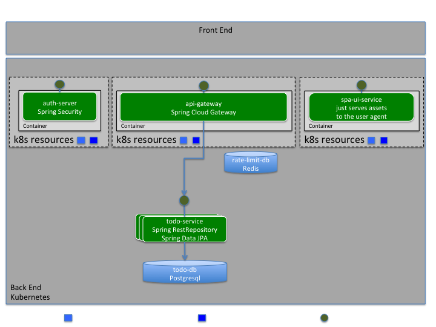

# jsprbt-fa8-k8s
PoC de Java 8+ Spring Boot com Kubernetes 



---
# Pré-Requisitos

### Frontend:
* AngularJS;
* HTML 5;

### Backend:
* Java (versão mínima 8.);
* Springboot; *
* Springdata; *
* SpringREST; *
* SpringBatch;
* SpringSecurity;

### Banco de Dados:
* SQL, Oracle ou PostgreSQL *

### Repositório de controle de versão:
* Git *

Instale o git de acordo com o sistema operacional utilizado.

Clone este repositório:

```bash
git clone https://github.com/morganyvm/jsprbt-fa8-k8s.git
```

### Dev Environment
* Maven; *
(versão mínima 3.5.3)

* [Fabric8 (plugin maven para build e deployment no kubernetes);](http://spring.fabric8.io "fabric8")  


## Java
Necessário para o ambiente de desenvolvimento (`build`, testes e empacotamento) e para a execução das aplicações spring boot, executando dentro dos `containers` Docker.
Para os `containers` Docker a implementação selecionada é o OpenJDK. E a versão mínima da JVM é a versão 8 (OpenJDK 8 update 131), pois, somente à partir dessa versão do OpenJDK a JVM passa a entender os limites de memória e cpu dos `containers` Docker.


## Helm
[Helm](https://www.helm.sh helm) é uma ferramenta para gerenciar charts Kubernetes. Charts são pacotes 
de recursos Kubernetes pré-configurados.

### Instalacao
* https://docs.helm.sh/using_helm/#installing-helm


### Postgresql
Criação do banco de dados postgresql para o todo-service

```bash
$ helm init 
$ helm install --name todo-service-db \
  --set postgresUser=todo-user,postgresPassword=${random},postgresDatabase=todo-db \
    stable/postgresql
```

A execução do comando acima vai imprimir algo similar ao resultado abaixo: 

```bash
NAME:   todo-service-db
LAST DEPLOYED: Mon Jul 30 01:56:46 2018
NAMESPACE: default
STATUS: DEPLOYED

RESOURCES:
==> v1/Secret
NAME                        TYPE    DATA  AGE
todo-service-db-postgresql  Opaque  1     0s

==> v1/ConfigMap
NAME                        DATA  AGE
todo-service-db-postgresql  0     0s

==> v1/PersistentVolumeClaim
NAME                        STATUS   VOLUME    CAPACITY  ACCESS MODES  STORAGECLASS  AGE
todo-service-db-postgresql  Pending  hostpath  0s

==> v1/Service
NAME                        TYPE       CLUSTER-IP     EXTERNAL-IP  PORT(S)   AGE
todo-service-db-postgresql  ClusterIP  10.100.137.67  <none>       5432/TCP  0s

==> v1beta1/Deployment
NAME                        DESIRED  CURRENT  UP-TO-DATE  AVAILABLE  AGE
todo-service-db-postgresql  1        1        1           0          0s

==> v1/Pod(related)
NAME                                        READY  STATUS   RESTARTS  AGE
todo-service-db-postgresql-b4ccff6c4-pb8zw  0/1    Pending  0         0s


NOTES:
PostgreSQL can be accessed via port 5432 on the following DNS name from within your cluster:
todo-service-db-postgresql.default.svc.cluster.local
To get your user password run:

    PGPASSWORD=$(kubectl get secret --namespace default todo-service-db-postgresql -o jsonpath="{.data.postgres-password}" | base64 --decode; echo)

To connect to your database run the following command (using the env variable from above):

   kubectl run --namespace default todo-service-db-postgresql-client --restart=Never --rm --tty -i --image postgres \
   --env "PGPASSWORD=$PGPASSWORD" \
   --command -- psql -U todo-user \
   -h todo-service-db-postgresql todo-db


To connect to your database directly from outside the K8s cluster:
     PGHOST=127.0.0.1
     PGPORT=5432

     # Execute the following commands to route the connection:
     export POD_NAME=$(kubectl get pods --namespace default -l "app=postgresql,release=todo-service-db" -o jsonpath="{.items[0].metadata.name}")
     kubectl port-forward --namespace default $POD_NAME 5432:5432

```

### Redis
Criação do Redis para rate-limit do API Gateway

```bash
$ helm install --name api-gateway-rate-limit-db \
  --set password=${random} \
    stable/redis
```


A execução do comando acima vai imprimir algo similar ao resultado abaixo:

```bash
NAME:   api-gateway-rate-limit-db
LAST DEPLOYED: Mon Jul 30 02:36:11 2018
NAMESPACE: default
STATUS: DEPLOYED

RESOURCES:
==> v1/Secret
NAME                             TYPE    DATA  AGE
api-gateway-rate-limit-db-redis  Opaque  1     0s

==> v1/Service
NAME                                    TYPE       CLUSTER-IP     EXTERNAL-IP  PORT(S)   AGE
api-gateway-rate-limit-db-redis-master  ClusterIP  10.111.9.103   <none>       6379/TCP  0s
api-gateway-rate-limit-db-redis-slave   ClusterIP  10.99.221.117  <none>       6379/TCP  0s

==> v1beta1/Deployment
NAME                                   DESIRED  CURRENT  UP-TO-DATE  AVAILABLE  AGE
api-gateway-rate-limit-db-redis-slave  1        1        1           0          0s

==> v1beta2/StatefulSet
NAME                                    DESIRED  CURRENT  AGE
api-gateway-rate-limit-db-redis-master  1        1        0s

==> v1/Pod(related)
NAME                                                    READY  STATUS             RESTARTS  AGE
api-gateway-rate-limit-db-redis-slave-85cc5674cc-59kbj  0/1    ContainerCreating  0         0s
api-gateway-rate-limit-db-redis-master-0                0/1    ContainerCreating  0         0s


NOTES:
** Please be patient while the chart is being deployed **
Redis can be accessed via port 6379 on the following DNS names from within your cluster:

api-gateway-rate-limit-db-redis-master.default.svc.cluster.local for read/write operations
api-gateway-rate-limit-db-redis-slave.default.svc.cluster.local for read-only operations


To get your password run:

    export REDIS_PASSWORD=$(kubectl get secret --namespace default api-gateway-rate-limit-db-redis -o jsonpath="{.data.redis-password}" | base64 --decode)

To connect to your Redis server:

1. Run a Redis pod that you can use as a client:

   kubectl run --namespace default api-gateway-rate-limit-db-redis-client --rm --tty -i \
    --env REDIS_PASSWORD=$REDIS_PASSWORD \
   --image docker.io/bitnami/redis:4.0.10-debian-9 -- bash

2. Connect using the Redis CLI:
   redis-cli -h api-gateway-rate-limit-db-redis-master -a $REDIS_PASSWORD
   redis-cli -h api-gateway-rate-limit-db-redis-slave -a $REDIS_PASSWORD

To connect to your database from outside the cluster execute the following commands:

    export POD_NAME=$(kubectl get pods --namespace default -l "app=redis" -o jsonpath="{.items[0].metadata.name}")
    kubectl port-forward --namespace default $POD_NAME 6379:6379
    redis-cli -h 127.0.0.1 -p 6379 -a $REDIS_PASSWORD

```


### Ingress Controller
Criação do Ingress Controller com o Nginx.

```bash
$  helm install stable/nginx-ingress --name challenge-ingress-controller-nginx
```

Ou abaixo com RBAC (Role Based Access Control)
 
```bash
$  helm install stable/nginx-ingress --name challenge-ingress-controller-nginx --set rbac.create=true
```

A execução do comando acima vai imprimir algo similar ao resultado abaixo:

```bash
NAME:   challenge-ingress-controller-nginx
LAST DEPLOYED: Mon Jul 30 11:48:32 2018
NAMESPACE: default
STATUS: DEPLOYED

RESOURCES:
==> v1beta1/Deployment
NAME                                                             DESIRED  CURRENT  UP-TO-DATE  AVAILABLE  AGE
challenge-ingress-controller-nginx-nginx-ingress-controller      1        1        1           0          0s
challenge-ingress-controller-nginx-nginx-ingress-default-backen  1        1        1           0          0s

==> v1beta1/PodDisruptionBudget
NAME                                                             MIN AVAILABLE  MAX UNAVAILABLE  ALLOWED DISRUPTIONS  AGE
challenge-ingress-controller-nginx-nginx-ingress-controller      1              N/A              0                    0s
challenge-ingress-controller-nginx-nginx-ingress-default-backen  1              N/A              0                    0s

==> v1/ConfigMap
NAME                                                         DATA  AGE
challenge-ingress-controller-nginx-nginx-ingress-controller  1     1s

==> v1/ServiceAccount
NAME                                              SECRETS  AGE
challenge-ingress-controller-nginx-nginx-ingress  1        1s

==> v1beta1/ClusterRoleBinding
NAME                                              AGE
challenge-ingress-controller-nginx-nginx-ingress  0s

==> v1beta1/Role
NAME                                              AGE
challenge-ingress-controller-nginx-nginx-ingress  0s

==> v1beta1/RoleBinding
NAME                                              AGE
challenge-ingress-controller-nginx-nginx-ingress  0s

==> v1/Service
NAME                                                             TYPE          CLUSTER-IP     EXTERNAL-IP  PORT(S)                     AGE
challenge-ingress-controller-nginx-nginx-ingress-controller      LoadBalancer  10.106.23.131  <pending>    80:30529/TCP,443:31827/TCP  0s
challenge-ingress-controller-nginx-nginx-ingress-default-backen  ClusterIP     10.108.91.185  <none>       80/TCP                      0s

==> v1/Pod(related)
NAME                                                             READY  STATUS             RESTARTS  AGE
challenge-ingress-controller-nginx-nginx-ingress-controllekwppx  0/1    ContainerCreating  0         0s
challenge-ingress-controller-nginx-nginx-ingress-default-bpg5np  0/1    ContainerCreating  0         0s

==> v1beta1/ClusterRole
NAME                                              AGE
challenge-ingress-controller-nginx-nginx-ingress  0s


NOTES:
The nginx-ingress controller has been installed.
It may take a few minutes for the LoadBalancer IP to be available.
You can watch the status by running 'kubectl --namespace default get services -o wide -w challenge-ingress-controller-nginx-nginx-ingress-controller'

An example Ingress that makes use of the controller:

  apiVersion: extensions/v1beta1
  kind: Ingress
  metadata:
    annotations:
      kubernetes.io/ingress.class: nginx
    name: example
    namespace: foo
  spec:
    rules:
      - host: www.example.com
        http:
          paths:
            - backend:
                serviceName: exampleService
                servicePort: 80
              path: /
    # This section is only required if TLS is to be enabled for the Ingress
    tls:
        - hosts:
            - www.example.com
          secretName: example-tls

If TLS is enabled for the Ingress, a Secret containing the certificate and key must also be provided:

  apiVersion: v1
  kind: Secret
  metadata:
    name: example-tls
    namespace: foo
  data:
    tls.crt: <base64 encoded cert>
    tls.key: <base64 encoded key>
  type: kubernetes.io/tls

```


#### Ingress
Vá para o diretório do api-gateway e criee o recurso do ingress.

```bash
$ cd api-gateway
$ kubectl create -f src/main/fabric8/ingress.yml 
```


---

## fabric8/fabric8-maven-plugin

Para o build e deployment dos serviços (spa-ui, api-gateway, auth-server e todo-service) será utilizado o plugin fabric8.

O plugin fabric8 será responsável por empacotar as aplicações no `container` Docker e montar os graphs helm para `deployment` no Kubernetes.

Para implantar (`deployment`) os graphs helm no Kubernetes basta executar o comando abaixo:  
  

```bash
mvn clean install fabric8:deploy
```

---

# Referencias


* [Docker Documentation](https://docs.docker.com "Docker Docs")


* [Helm](https://www.helm.sh "helm")


* [Helm PostgreSQL Chart](https://github.com/helm/charts/tree/master/stable/postgresql "PostgreSQL")


* [Helm Redis Chart](https://github.com/helm/charts/tree/master/stable/redis "Redis")


* [Helm Ingress Nginx](https://github.com/helm/charts/tree/master/stable/nginx-ingress "Ingress Nginx")


* [Nginx Ingress Controller](https://kubernetes.github.io/ingress-nginx/deploy "Nginx Ingress Controller")


* [K8s ConfigMap](https://kubernetes.io/docs/tasks/configure-pod-container/configure-pod-configmap#add-configmap-data-to-a-volume "ConfigMap") 


* [Fabric8 Maven Plugin](https://maven.fabric8.io "fabric8")

